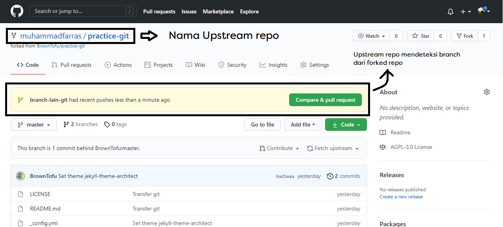

# Forking Github Repository (Chapter 6)
Catatan berikut bersumber dari **Github for Dummies by Sarah Guthals, Phd & Phil Hacck** dihalaman 97.

##Daftar Isi
* [Pengenalan Tentang Forking](#Pengenalan-tentang-Forking)
* [Cloning, Forking, & Duplicating](#Cloning,-Forking,-&-Duplicating)
* [Cloning sebuah Repositori](#Cloning-sebuah-Repositori)
* [Fetching (Mengambil) perubahan dari upstream](#Fetching-(Mengambil)-perubahan-dari-upstream)
* [Forking repository](#Forking-repository)


## Pengenalan tentang Forking
sebuah fork dari Repositori adalah salinan dari sebuah repositori. Didalam pengembangan sebuah sumber daya terbuka (open source), *forking* digunakan untuk membagi dengan developer atau belajar dari kode dalam repositori tersebut. Secara umum pengembang aplikasi  memiliki tujuan yang berbeda-beda ketika mereka mem- *forking* sebuah repositoru, tapi ada tiga alasan utama, diantaranya;

1. Berkontribusi dengan projek orang lain.
2. Menggunakan projek orang lain sebagai titik awal.
3. Melakukan eksperimen pada kode oranglain tanpa membuat perubahan pada projek mereka.

Jika kita bukan pemilik atau kolabolator dalam projek tersebut, kita harus mem- *fork* repositori tersebut. 
Jika kita memliki rencana untuk membuat perbahan terhadap repostori tersebut dimana kita bukanlah pemiliki atau kolabolator, maka **fork** repo terlebih dahulu sehingga kita dalam kondisi yang benar (state) pada saat kita memulai untuk mengekspolrasi dan memodifikasi kode.

## Cloning, Forking, & Duplicating
Kettika jikta **clone** sebuah repo di *GitHub*, kita membuat salinan lokal dari projek kedalam komputer kita.**Forking** sebuah repo di *GitHub* membuat sebua salinan dari repo kedalam akun *GitHub.com* kita, dan dari sana, kita dapat meng-**Clone** repo tersebut. Pehubung antara repo asil dan repo yang kita **fork** akan tetap bertahan, pehubung tersebutlah yang membuat kita dapat meng-**pull** perubahan yang terjadi di repo asil kedalam repo salinan kita dan meng-**push** perubahan yang kita buat didalam salinan kita ke salinan asli.

**Duplicating** sebuah repo adalah kondisi dimana kita membuat sebuah salinan dari repo yang sudah tidak ada lagih penghubung ke repo asil. **Duplication** biasanya tidak digunakan pada bagian alur kerja sumber daya terbuka (open source) karena akan menemukan kesulitan untuk meng-**push** perubahan ke repo aslinya. Namun ada saatnya **duplicating** sebuah repo sangat berguna, seperti repo dari projek asli yang sudah lama tidak aktif dan kita berencana untuk membuat projek tersebut tetap aktif dengan fork kita.

## Cloning sebuah Repositori
Kita dapa meng-*cloning* repo publik manapun, dan kita dapat menjalankan kode serta membuat perubahan pada kode tersebut. Akan tetapi kita tidk dapat meng-*push* perubahan tersebut ke *remote repo* jika kita tidak memliki izin pada repo tersebut.
Sebelum kita mengkloning sebuah repositorim pastika kita dapat meng-*push* perbahan. Cara paling mudah untuk mengtahui hal tersebut adalah dengan melihat beranda repositoru tersebut, jika kite melihat **tab setting** disebalah kana beranda maka kita dapat hak untuk menge-*push*. Jika tidak maka kita harus membuat fork repositori dulu.

```
$ git clone https://github.com/BrownTofu/practice-git.git
Cloning into 'practice-git'...
remote: Enumerating objects: 11, done.
remote: Counting objects: 100% (11/11), done.
remote: Compressing objects: 100% (10/10), done.
remote: Total 11 (delta 2), reused 6 (delta 0), pack-reused 0
Unpacking objects: 100% (11/11), 104.56 KiB | 90.00 KiB/s, done.
```

you can verify where the remote/target repo is with the following command:
```
$ git remote -v
origin  https://github.com/BrownTofu/practice-git.git (fetch)
origin  https://github.com/BrownTofu/practice-git.git (push)
```

Jika kita menggunakan command `git remote -v` didalam Git repo yang tidak memiliki `remote origin` (repo tersebut tidak berasal dari Github.com atau dari tempat remote yang lain), maka setelah kita menjalan command tersebut tidak akan mengaembalikan informasi apapun.

## Forking repository
Tujuan dari open source adalah untuk mendorong kolaborasi diantara pengembang aplikasi di seluruh dunia, maka dari itu dapat berkontribusi dalam penulisan kode pada repositori-repositoru dimana kita bukan pemilik atau kolabolator adalah bagian terpenting dari alur kerja Github.
Untuk menjadi kolabolator dari open source project, kita dapat menghubungi pemilik repo dan meminta untuk dijadikan sebuah kolabolator. Namun, jika pemilik tidak mengenal siapa kita, mungkin mereka tidak akan menambahkan kita menjadi kolabolator yang mana memiliki hak akses untuk meng-*push* ke repositoru.

> Penting, Kita tidak butuh ijin dari pemilik untuk mem-*forking* repositori merekan. Kita dapat membuat kontribusi berupa penambahan algoritma pada sebuah kode dan membagikannya kepada pemilik repo untuk menunjukan kepada mereka kita dapat menjadi aset pada projek mereka.

Setelah menekan tombik *fork*, halaman web akan ter-refreshm dan kita akan melihat modified version of the repo, setelah kita mem-fork, selanjutnya kita dapat mengkloning repo tersebut kedalam lokal komputer untuk memulai perubahan.


>Git does have the concept of a remote, which is a pointer  to a copy of the same Git repository hosted elsewhere. Typically, a remote is a URL to a Git-hosting platform like GitHub, but it’s possible to be a path to a directory with a copy of the repository. When you clone a repository, Git adds a remote named origin with the location (usually a URL) from where you cloned it. But it’s possible to add multiple remotes to a Git repository to indicate other locations 
where you may want to push and pull changes from. For example, if you clone a fork of a repository, you may want to have a remote named upstream that points to the original repository

Kita dapat melihat forked remote origin dan original remote upstream setelah kita menjalankan `git remote -v` didalam direktori dimana kita mengkloning repo.

```
$ git remote -v
origin  https://github.com/muhammadfarras/practice-git.git (fetch)
origin  https://github.com/muhammadfarras/practice-git.git (push)
upstream        https://github.com/BrownTofu/practice-git.git (fetch)
upstream        https://github.com/BrownTofu/practice-git.git (push)
```

*Origin* yaitu, darisitulah kita *fetch/pull*, dan *push* perubahan, dari contoh diatas origin tercantum didalam nama id kita **muhammad farras*.
*Upstream* yaitu, tempat dimana original kode berlokasi, dan dimana pada akhirnya kita ingin berkontribusi dengan koda kita, serta tercantum nama dari pemilik aslinya (browntofu)

---
*Jika kita mengkloning repo dari command run, setelah kita menjalan git remote -v, hanya kumcul remote origin saja, selanjutanya kita harus mengatur upsream remote. InsyaAllah akan dibahas pada bagian [ini](#Terhambat-ketika-kloning-tidak-dengan-forking)*

```
# tampilan jika clone lewat cmd
$ git remote -v
origin  https://github.com/muhammadfarras/practice-git.git (fetch)
origin  https://github.com/muhammadfarras/practice-git.git (push)
```
---

## Fetching (Mengambil) perubahan dari upstream # Forking repository
Memiliki upstream repo yang terhubung dengan forked repo kita sangatlah penting. Saat kita memulai merubah kode, kita berharap dapat *fetch/pull* perubahan pada kode yang asli kedalam kode kita untuk memastikan bahwa kita memiliki versi yang paling terbaru.

```
$ git fetch upstream
remote: Enumerating objects: 5, done.
remote: Counting objects: 100% (5/5), done.
remote: Compressing objects: 100% (3/3), done.
remote: Total 3 (delta 2), reused 0 (delta 0), pack-reused 0
Unpacking objects: 100% (3/3), 755 bytes | 6.00 KiB/s, done.
From https://github.com/BrownTofu/practice-git
   9ad5aaa..b8e4eba  master     -> upstream/master
```

Setalah kita mengambil (*fetching*) dari upstream, ketik perintah `git checkout -b nama-branch` untuk membuat branch baru dan mengarahkan kita langsung ke branch tersebut.
Untuk ilmu lebih lanjut tentang branch dapat melihat ke [catatan tetang branch](https://github.com/muhammadfarras/catatan-practice-github/blob/master/2.%20Branch.md)

```
$ git checkout -b branch-lain-git
Switched to a new branch 'branch-lain-git'
```

Selanjutnya kita gabungkant *merge* repo branch kita dengan upstream repo.
```
$ git merge upstream/master
Updating 9ad5aaa..b8e4eba
Fast-forward
 README.md | 5 +++--
 1 file changed, 3 insertions(+), 2 deletions(-)
```

## Memberikan kontribusi ke upstream
Setelah kita membuat perubahan dan mempublisnya ke forked repository yang baru, kita sudah bisa untuk memberi saran terhadap perubahan kita ke pemilik aslinya. Jika kita pergi ke original upstream repo di Github.com, branch kita akan tampil di beranda, dan Github akan menayakan kita apakah kita ingin membuka *pull request* untuk digabungkan dengan original repo.

```
$ git push --set-upstream origin branch-new
Logon failed, use ctrl+c to cancel basic credential prompt.
Enumerating objects: 5, done.
Counting objects: 100% (5/5), done.
Delta compression using up to 4 threads
Compressing objects: 100% (3/3), done.
Writing objects: 100% (3/3), 325 bytes | 325.00 KiB/s, done.
Total 3 (delta 2), reused 0 (delta 0)
remote: Resolving deltas: 100% (2/2), completed with 2 local objects.
remote:
remote: Create a pull request for 'branch-new' on GitHub by visiting:
remote:      https://github.com/muhammadfarras/practice-git/pull/new/branch-new
remote:
To https://github.com/muhammadfarras/practice-git.git
 * [new branch]      branch-new -> branch-new
Branch 'branch-new' set up to track remote branch 'branch-new' from 'origin'.
```



Setelah itu kita bisa melihat branch master kita sudah di merge dengan branch yang baru kita buat serta sekaligus mengirimkan pull request ke pemiliki dari upstream repo. Selanjutnya keputusan dari pemilik repo tersebut apakah ingin di merge atau tidak.


## Getting unstuck when cloning withou forking
Masalah yang paling sering dihadapi terjadi karena kita lupa untuk mem-fork sebuah repositoru sebelum memulau berkontirbusi. Contoh yang sering terjadi kita tidak memiliki akses untuk berkontribusi pada repo yang kita maksud.

```
$ git push
ERROR: Permission to BrownTofu/practice-git.git denied to muhammadfarras.
fatal: Could not read from remote repository.

Please make sure you have the correct access rights
and the repository exists.

```

Pesan yang muncul memberitahukan kita bahwa kita tidak memliki izin untuk meng-push ke repo tersebut. Kita harus mem-fork repositori terlebih dahulu, dan kesalahan kita juga meng-commit langsung ke master. padahal sangat direkomendasikan untuk membuat sebuah perubahan kode didalam sebuah branch

> sangat direkomendasikan untuk membuat sebuah perubahan kode didalam sebuah branch
---
Berikut adalah langkah-langkah perbaikan
1. Migrasikan perubahan kita dalam branch


